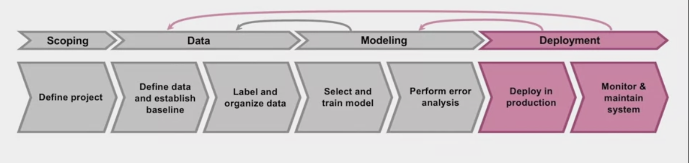
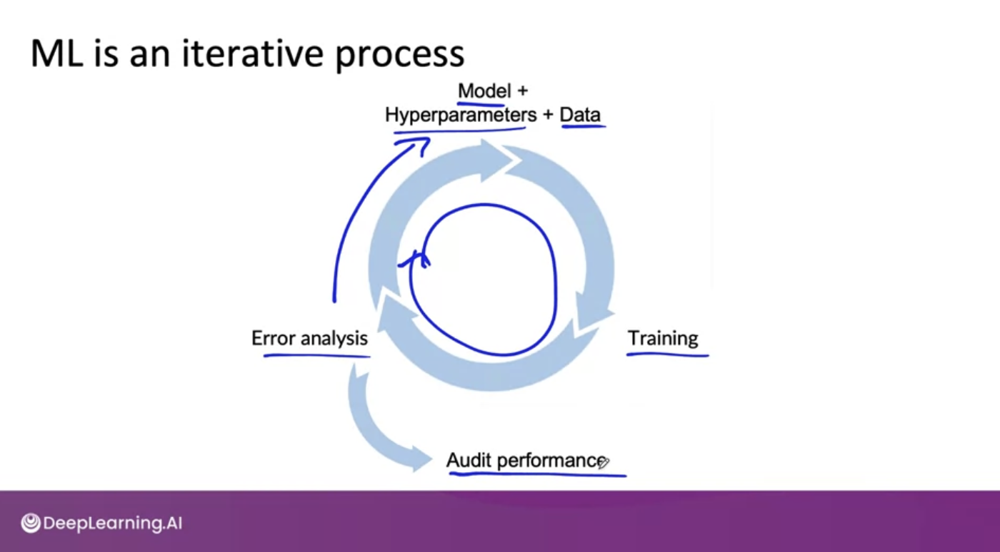
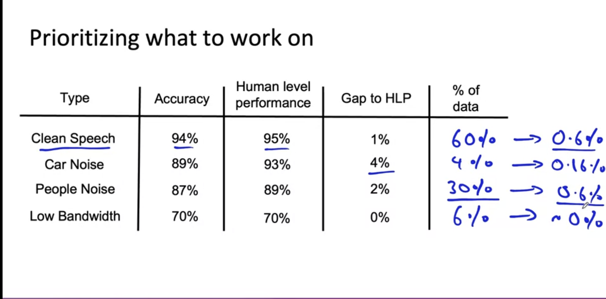
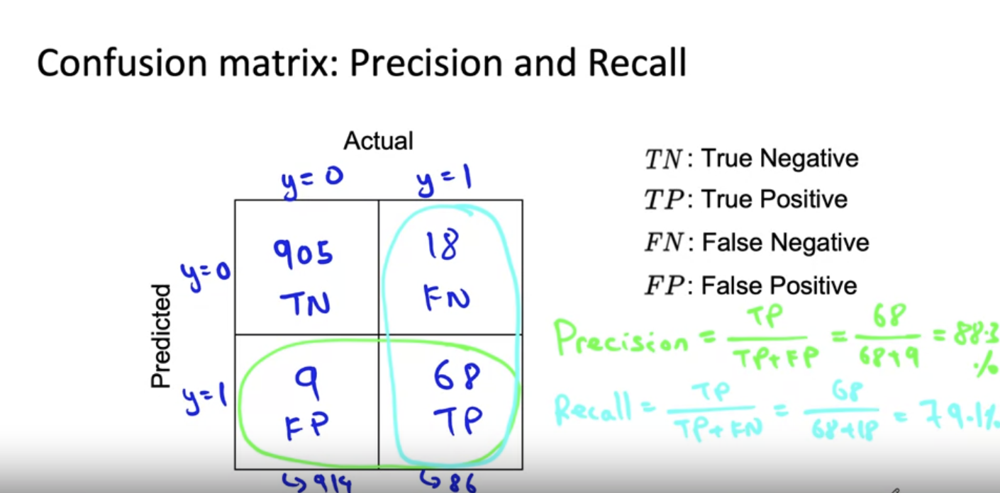
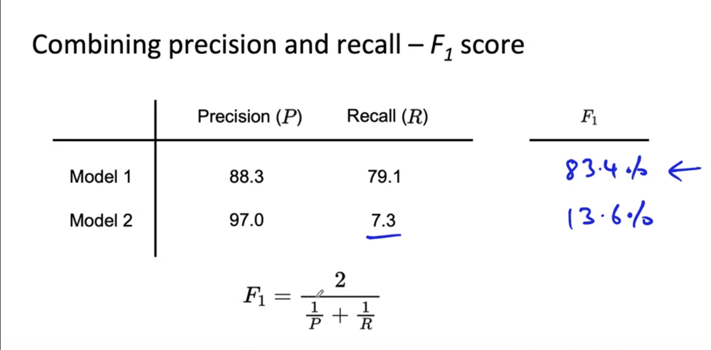
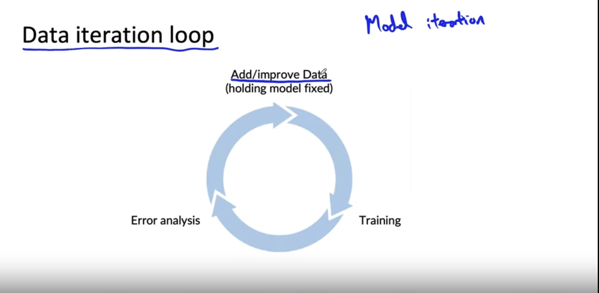
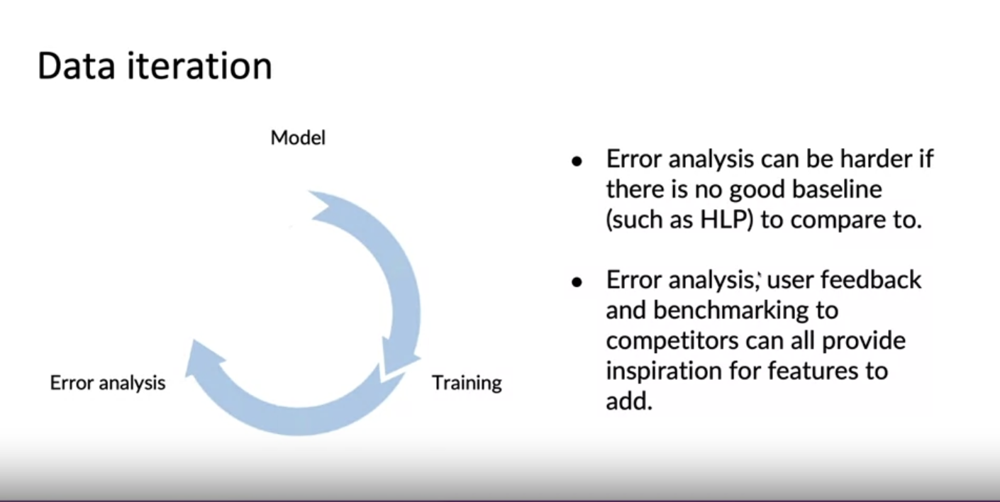

# Part1: Introduction to Machine Learning in Production
> Machine Learning Engineering for Production (MLOps) Specialization by DeepLearning.AI

- [Link](https://www.coursera.org/specializations/machine-learning-engineering-for-production-mlops#courses)

# Week 1: Intro

## ML lifecycle

1. Scoping
    - define project
2. Data
    - define data
    - label and organize data
3. Modeling
    - select and train
    - perform error analysis
4. Deployment
    - Deploy in production
    - Monitor & maintain system

## Case study: speech recognition

1. Scoping
    - "Decide to work on speech recognition for voice spearch"
    - key metrics: Accuracy, latency, throughput
    - Estimate time schedule to finish this scope
2. Define Data
    - labeled consistently (i.g convention)
    - How much silence before / after each clip?
    - How to perform volume normalization
3. Modeling
    - Code (algo / model)
    - Hyperparameters, Data
    - **ml system = code + data**
4. Deployment
    - edge device -> mobile phone -> microphone -> VAD module to send speech API to the prediction Server
    - **concept / data drift**

## Course outline

1. Deployment
2. Modeling
3. Data
    - (opt) Scoping

# Week 1: Deployment

## Key challenges

- Concept drift and Data drift
    - Q. "How has the data changed?"
    - Gradual change, somtime sudden change (covid-19 affects card data)
    - Concept drift: x -> y, relation change which means "evolution of data that invalidates the data model."

## Deployment patterns

### Common Cases
1. New product / capability
2. Automate /assist with manual task
3. Replace prev ML system

- shadow mode, validate model
- canary deployment(gradually), roll out by small fraction 
- blue / green

### Degrees of automation

Human only -> shadow mode -> HITL( ai assistance -> Partial automation ) -> Full automation

## Monitoring

### Monitoring dashboard

1. Brainstorm the thigns that could go wrong
2. From brainstrom -> pick metrics
3. iterate and choose right set of metrics to monitor

### Examples

- sw metrics: memotry, compute, latency, throughput, server load
- Input metrics(X): Avg input length, Avg input volume, Num missing values, Avg image brightness
- Output mertics(Y): times return null, times user redoes search, times user switches to typing, CTR

## Pipline monitoring
> Metrics to monitor

1. Monitor: sw metrics, input and output mertics
2. How quickly do they change?
    - user dat agenerally has slower drift
    - enterprise data can shift fast (B2B data shifts quickly)

- [week1 Exercise](./week1_server.ipynb)

# Week 2: Modeling

- Model-centric AI development
- Data-centric AI development

## Why low average error isn't good enough

> AI system = Code(algo / model) + Hyperparameters + Data

- **Performance on disproportionately important examples**

i.g web search 

1. Informational and Transactional queries
  - Apple pie recipe
  - latest movies
  - world cup
2. Navigational queries
  - harvard, reddit, youtube, cnn

- **key slices of dataset**

- **rare classes**
    - skewed data distribution

**Beyond the test sets!**

## Establish a baseline

- Establishing a base line level of Performance. (i.g speech recognition)
    - `HLP`(Human level performance) can be point of compare
- Unstructured and structured data
    - HLP mostly good at unstructured data (image, audio, text)

## Ways to establish a baseline

1. HLP
2. Literature search
3. Quick and dirty impl
4. Perfornace of older system

- Human level performance (HLP) is generally more effective for establishing a baseline on unstructured data problems (such as images and audio) than structured data problems
- **For unstructured data problems, using human-level performance as the baseline can give an estimate of the irreducible error/Bayes error and what performance is reasonable to achieve.**

## Tips for gettings started
> ML project start tips

1. Literature search to see what's possible(courses, blogs, open-source projects)
    - spend half day to get info
2. Find open-source impl if available
3. A reasonable algorithm with **good data** will often outperform a great algorithm with not so good data

## Error and analysis example

- Generate tag that effects to y

## Prioritizing what to work on

- How much room for improvement there is 
- How freq that category(tag) appears
- How easy to improve
- How important it is to improve in that category

## Skewed datasets

- Accuracy not that useful on this kinds of datasets

### Confusion matrix
> precision and recall

- Need `Confusion matrix`: Precision and Recall

mostly recall 

### F1 score
>  precision good model vs recall good model comparison

## Performance auditing

1. Brainstorm the ways the system might go wrong
    - performance on subsets of data (gender, ethnicity)
    - How common are certain errors (FP, FN)
    - Performance on rare classes
2. Establish metrics to assess performance against these issues on appropriate **slices of data**

# Week2: Data-centric AI developemnt

## Unstructured Data: Data augmentation

- data augmentation, usually unstructured data
- i.g. voice signal + noise(background music, cafe noise, airplane noise)

Goal: **Create realistic examples that 1) the algorithm does poorly on, but 2) humans (or other baseline) do well on.**

Tip: sanity check -> figure out whether needs data augmentation

Checklist
- Does it sound realistic?
- Is the x -> y mapping clear? **i.g. Which means can humans recognize speech?**
- Is the algo currently doing poorly on it?

### Data iteration loop

## Unstructured Data: Can adding data hurt Performance?

For unstructured data problems, if:

- The model is large (low bias)
- The mapping x -> y is clear (e.g. given only the input x, humans can make accurate predictions)
    - i.g 1 vs I image ocr, this case may hurts accuracy performance

**Then, adding data rarely hurts accuracy**

## Structured Data: Adding features

> Over the last several years, there's been a trend in product recommendations of a shift from collaborative filtering approaches to what content based filtering approaches. Collaborative filtering approaches is loosely an approach that looks at the user, tries to figure out who is similar to that user and then recommends things to you that people like you also liked. In contrast, a content based filtering approach will tend to look at you as a person and look at the description of the restaurant or look at the menu of the restaurants and look at other information about the restaurant, to see if that restaurant is a good match for you or not. The advantage of content based filtering is that even if there's a new restaurant or a new product that hardly anyone else has liked by actually looking at the description of the restaurant, rather than just looking at who else like the restaurants, you can more quickly make good recommendations. This is sometimes also called the Cold Start Problem. How do you recommend a brand new product that almost no one else has purchased or like or dislike so far? And one of the ways to do that is to make sure that you capture good features for the things that you might want to recommend. Unlike collaborative filtering, which requires a bunch of people to look at the product and decide if they like it or not, before it can decide whether a new user should be recommended the same product.

- If you don't have large data set, you should designing features especially for structured data problems can still be a very important driver of performance improvement. 

- Unstructured data maybe don't need feature design because learning algorithms are very good at learning features automatically for images, audio, and for text maybe but for structured data, it's okay to go in and work on the features

## Structured Data: Experiment tracking

what to track?

1. algorithm / code versioning
2. Dataset used
3. Hypermarameters
4. Results

Tracking tools

1. Text files
2. Spreadsheet
3. Experiment tracking system

Desirable features on Experiment tracking system

1. Information needed to replicate results
2. Experiment results, ideally with summary metrics / analysis
3. Resource monitoring
    - cpu usage, memory, time cost ...
4. visualization
5. model error analysis

## Good data

1. Covers important cases (good coverage of inputs x)
2. Definition of labels y is unambiguous (defined consistently)
3. Distribution covers data drift and concept drift (Has timely feedback from production data)
4. Is sized appropriately

**The paradigm behind Deep Learning is now facing a shift from model-centric to data-centric**

## Excercise

- Manually move images around the filesystem so they are stored in a structure suitable for model training.

- Clean up the dataset as it presents some corrupted images and other issues.

- See how class imbalance negatively affects model evaluation.

- Solve overfitting problems by using Data Augmentation techniques.

- [week2](./week2_Birds_Cats_Dogs.ipynb)

# Week3: Define Data and Establish Baseline

